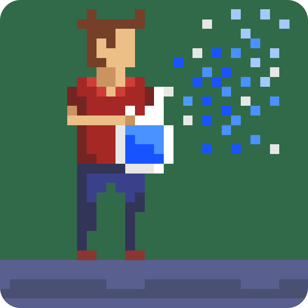
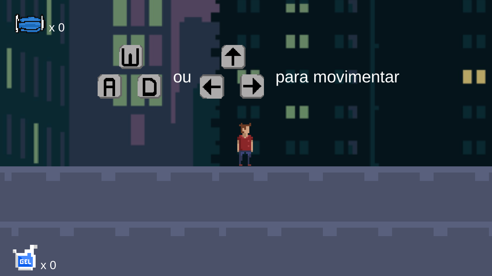
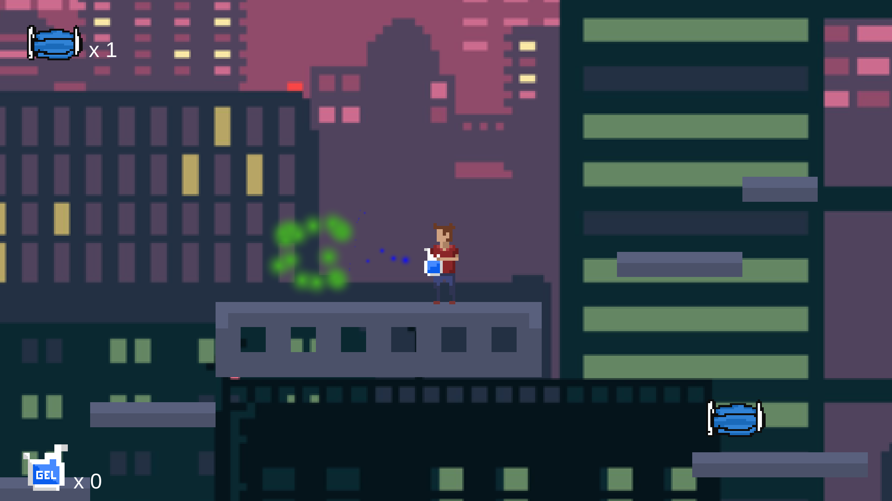
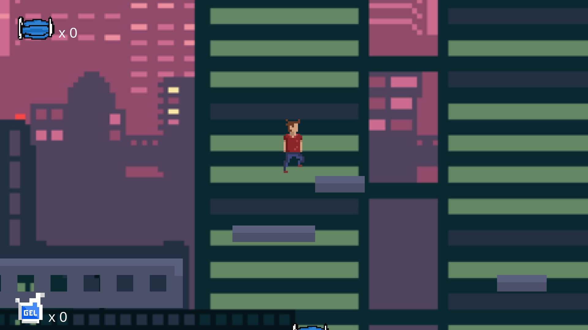

  
  <h2>Lockdown - Platformer</h2>
  <h4><a href="https://gust4vosales.itch.io/lockdown-platformer">PLAY</a></h4>

My first game. A 2D platformer with Covid-19 theme

  
  
  

 

## 📜 About

This project is created with Unity Engine, it is my first game, I've made the art (except the background) and all sound effects as well.
<a href="https://gust4vosales.itch.io/lockdown-platformer">PLAY</a>
 
